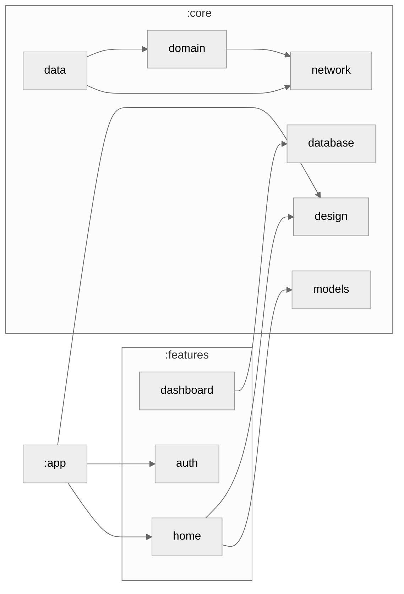

### Module Graph

```mermaid
%%{
  init: {
    'theme': 'neutral'
  }
}%%

graph LR
  subgraph :core
    :core:data["data"]
    :core:domain["domain"]
    :core:network["network"]
    :core:database["database"]
    :core:design["design"]
    :core:models["models"]
  end
  subgraph :features
    :features:dashboard["dashboard"]
    :features:home["home"]
    :features:auth["auth"]
  end
  :core:data --> :core:domain
  :core:data --> :core:network
  :core:domain --> :core:network
  :features:dashboard --> :core:database
  :features:home --> :core:design
  :features:home --> :core:models
  :app --> :core:design
  :app --> :features:auth
  :app --> :features:home
```
##In-development